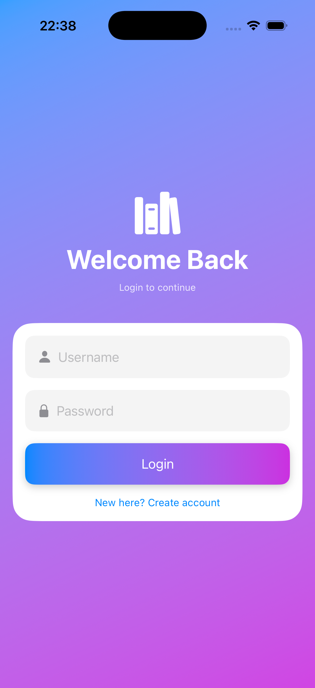
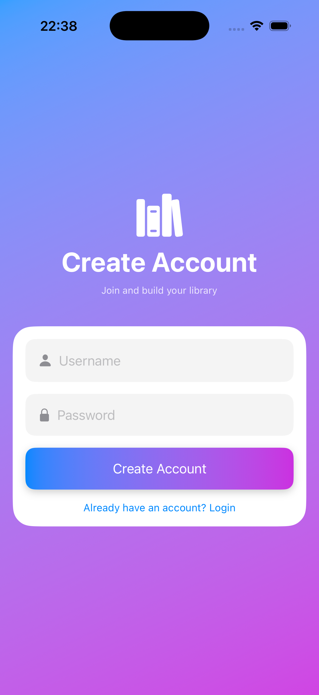

# BookVault 📚

BookVault is a SwiftUI iOS application for managing books using a Node.js and MongoDB backend.

---

# Features

- User Authentication (JWT)
- View Books
- Add Books
- Edit Books
- Delete Books
- Author & Genre Support
- REST API Integration

---

# Tech Stack

## Frontend
- SwiftUI
- Combine
- URLSession

## Backend
- Node.js
- Express.js
- MongoDB

---

# Screenshots

<p float="left">
  
  
  
  
</p>

---

# Installation

## Clone Repository

```bash
git clone https://github.com/matheshyogeswaran/BookVaultSwiftUI.git
```

## Open Project

Open the `.xcodeproj` or `.xcworkspace` file using Xcode.

## Run Backend

Make sure your backend server is running.

Example:

```bash
npm install
npm start
```

## Run iOS App

1. Open Xcode
2. Select Simulator
3. Press `Cmd + R`

---

# API Features

- JWT Authentication
- CRUD Operations
- MongoDB Integration
- RESTful APIs

---

# Author

Mathesh Yogeswaran
